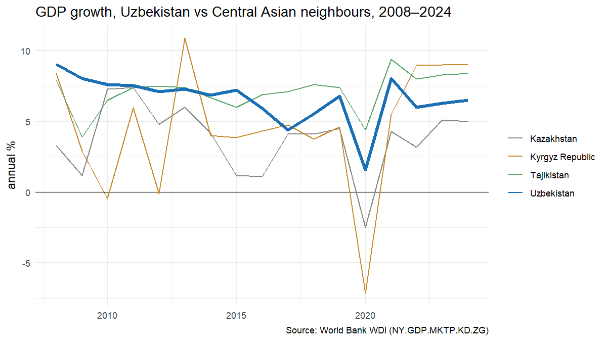
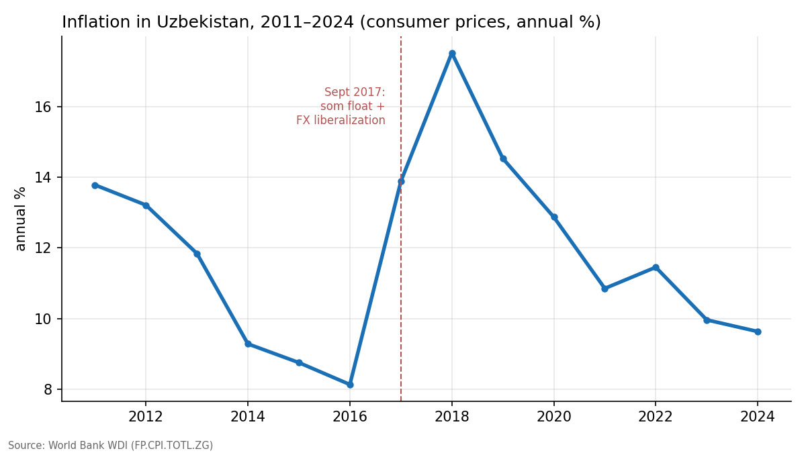
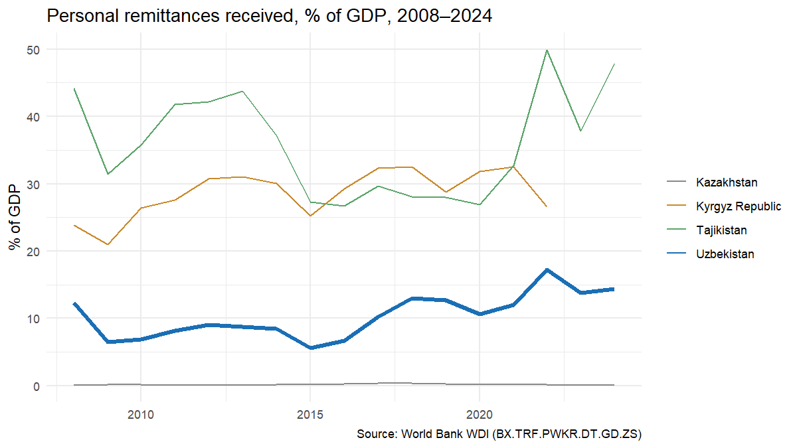

# Uzbekistan Macro Tracker

How has Uzbekistan's economy moved since the 2017 liberalization — and how does it compare with its Central Asian neighbours?



## Question

In September 2017 Uzbekistan floated the som and lifted most currency controls, the start of a broad market-opening programme. This project tracks three core indicators — GDP growth, inflation, and remittance inflows — for Uzbekistan, Kazakhstan, the Kyrgyz Republic, and Tajikistan, from 2008 to 2024.

## Data

All series come from the World Bank World Development Indicators (WDI), pulled with the [`WDI`](https://cran.r-project.org/package=WDI) R package:

| File | Indicator | WDI code |
|---|---|---|
| `data/gdp_growth.csv` | GDP growth, annual % | `NY.GDP.MKTP.KD.ZG` |
| `data/inflation.csv` | CPI inflation, annual % | `FP.CPI.TOTL.ZG` |
| `data/remittances.csv` | Remittances received, % of GDP | `BX.TRF.PWKR.DT.GD.ZS` |

The repo ships with a snapshot (last WDI update: April 2026). Run `R/01_download.R` to refresh it. WDI has gaps: Uzbek CPI starts in 2011 and Tajik CPI stops in 2016 in this source.

## Method

Descriptive analysis: tidy the series, plot them, read them against known policy events. No model — the goal is a clean, sourced picture of the macro story.

Run order: `R/01_download.R` (optional refresh) → `R/02_charts.R`.

## Findings

**Growth slowed after liberalization, then recovered.** Uzbek GDP growth averaged 7.4% in 2008–2016 under the old administrative model, and 5.6% in 2017–2024. The official pre-2017 figures are widely viewed as overstated, so the true gap is likely smaller. Uzbekistan was the only country of the four to avoid recession in 2020 (+1.6%).

**Liberalization had a visible price: inflation.** Freeing the exchange rate pushed CPI inflation from 8.1% (2016) to a 17.5% peak (2018). It has since eased to 9.6% (2024) — still above the central bank's 5% target.



**Remittances matter more, not less.** Remittance inflows roughly doubled as a share of GDP after liberalization, from ~6.7% (2016) to a 17.2% peak (2022) — the spike reflects transfers during the Russian mobilization year. Uzbekistan sits between resource-rich Kazakhstan (~0.1% of GDP) and remittance-dependent Tajikistan (~48% in 2024), which shapes how exposed each economy is to Russian conditions.



## Caveats

These are descriptive comparisons, not causal estimates. The 2017 reform coincided with commodity-price moves and regional shocks (COVID-19, 2022 sanctions on Russia), so simple before/after differences mix several forces. Pre-2017 Uzbek statistics are of contested quality.

## Structure

```
├── data/      # CSV snapshots from WDI
├── R/         # 01_download.R, 02_charts.R
└── output/    # charts used above
```
